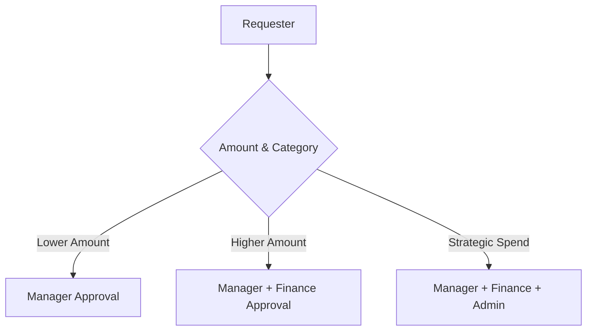
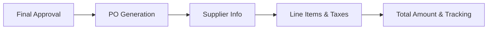
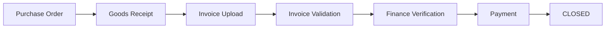
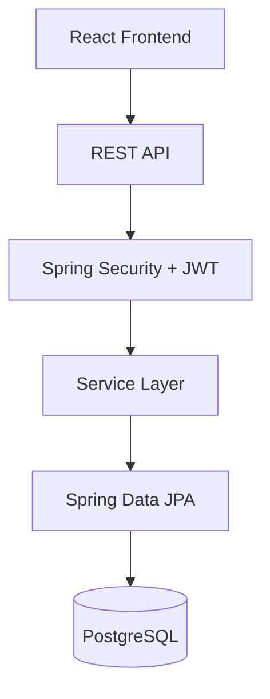

<div align="center">

# 🏢 Enterprise Procurement System

### Intelligent Source-to-Pay (S2P) Platform

**Infosys Springboard Group Project**

*A complete enterprise procurement platform that manages the lifecycle from purchase requisition and configurable approvals to purchase orders, goods receiving, invoice verification, payment, closure, reporting, and audit tracking.*


---
</div>

## Overview

The **Enterprise Procurement System** is an enterprise-style **Source-to-Pay (S2P)** application developed as part of the **Infosys Springboard Internship Program**.

Procurement is more than just purchasing. The system digitizes and centralizes organizational procurement operations. Employees can create purchase requisitions, configurable approval rules determine the required approval chain, authorized users review and approve requests, approved requisitions automatically generate Purchase Orders, receivers record goods, Finance verifies invoices and processes payments, and the transaction is finally closed with complete audit traceability.

The platform is designed around a real enterprise procurement lifecycle rather than a simple CRUD application.

---

## Core Workflow

The platform handles the entire Source-to-Pay lifecycle seamlessly:


---

## Role Matrix

The application supports role-based procurement operations. The backend securely detects and authorizes these roles.

| Role | Primary Responsibility |
|------|------------------|
| **Requester** | Create and track purchase requisitions |
| **Manager** | Review and approve assigned requests |
| **Finance** | Financial approvals, invoices, and payments |
| **Procurement Admin** | Procurement operations and final approvals |
| **Receiver** | Goods receiving and delivery recording |
| **System Admin** | Manage users, roles, and master data |

---

## Feature Overview

| Module | Capabilities |
|--------|--------------|
| **Authentication** | JWT, BCrypt, role-based access control (RBAC), secure sessions |
| **Requisitions** | Create, submit, track, and resubmit internal purchase requests |
| **Approval** | Dynamic approval routing, multi-level evaluation |
| **Purchase Orders** | Automatic generation and lifecycle tracking |
| **Receiving** | Partial and full goods receipt recording |
| **Invoices** | Invoice processing and amount validation against PO |
| **Payments** | Payment processing and automatic PO closure |
| **Audit** | Complete, traceable history of procurement actions |

---

## Live Approval Routing

Approval routing is driven by configurable **approval rules** in the database rather than a hardcoded frontend sequence. The system evaluates rules dynamically:

**Department** + **Category** + **Amount** ➡️ **Approval Rule Engine** ➡️ **Required Approval Chain**



The requester can see the expected live approval path before submitting the requisition.

---

## Requisition Workflow

1. Requester logs in and initiates a requisition.
2. Selects category and supplier.
3. Adds items, quantities, and prices.
4. System calculates the total amount.
5. Approval preview evaluates the required routing.
6. Request is submitted and stored.
7. Approval workflow begins.
8. Approver reviews and acts (Approve / Reject / Return).
9. History is permanently recorded.
10. Final approval triggers automatic PO generation.

### Approval History Traceability

The system maintains an exact lifecycle history for each request. Approval history records relevant user, role, action, timestamp, remarks, and status.

---

## Purchase Order Lifecycle

A Purchase Requisition is an internal request. A **Purchase Order (PO)** is the formal purchasing document generated automatically after the required approvals.



Requesters can track Purchase Orders associated with their requisitions, and procurement personnel can manage them organization-wide.

---

## Goods Receiving

The Receiver role provides the operational goods-receiving workflow. The system supports **Partial Receiving**.

**Example:**
* Ordered: 20
* Received: 15
* Remaining: 5

The remaining quantity can be received later, advancing the PO status from `PARTIALLY_DELIVERED` to `FULLY_DELIVERED`. Validation prevents over-receiving beyond the outstanding quantity.

---

## Invoice and Payment

Once goods are delivered, the financial lifecycle begins. The system implements validation to prevent invoices from exceeding the approved Purchase Order amount.



* **Validation:** If PO = ₹100,000 and Invoice = ₹120,000, it is **rejected**.
* **Closure:** After successful payment, the Purchase Order is automatically transitioned to `CLOSED`.

---

## Audit & Traceability

The application maintains a secure backend audit trail for important procurement operations.

| Event | Recorded Information |
|-------|----------------------|
| **Approval Actions** | User, role, action, timestamp, remarks |
| **PO Generation** | Entity, action, timestamp |
| **Goods Receipt** | Receiving action, user, and timestamp |
| **Invoicing / Payment** | Payment event and PO closure status |

---

## Notifications

The backend includes a scoped notification system for procurement events, alerting users directly within their dashboards.

* **Events Supported:** Approval pending, Requisition approved/returned, PO generated, Goods received, Invoice processed, Payment completed.

---

## Role-Based Dashboards

Each role receives a tailored enterprise dashboard focused purely on their responsibilities.

| Dashboard | Focus |
|-----------|-------|
| **Requester** | Requests, approvals, and personal Purchase Orders |
| **Manager** | Pending approvals and team approval history |
| **Finance** | Financial approvals, invoices, and payments |
| **Procurement Admin** | Procurement operations, master data, and final approvals |
| **Receiver** | Pending deliveries and goods receipts |

---

## System Architecture

The application follows a modern, decoupled layered architecture.



### Database Architecture
The persistent foundation relies on PostgreSQL. Core tables include:

* `users`, `roles`, `departments`, `categories`, `suppliers`, `cost_centers`
* `approval_rules`, `approval_rule_approvers`
* `requisitions`, `requisition_line_items`, `requisition_history`, `approval_history`
* `purchase_orders`, `po_line_items`, `po_receipts`
* `invoices`, `payments`, `notifications`, `audit_logs`

---

## Security

Security is strictly enforced at multiple levels:
- **JWT Authentication** and **BCrypt** password hashing.
- **Role-Based Access Control (RBAC)** enforced by the backend, not just frontend visibility.
- **Protected REST APIs** that validate roles at the Controller and Service levels.
- **User-Scoped Resources** to ensure requesters only see their own data.

---

## Technology Stack

| Layer | Technology |
|------|------------|
| **Frontend** | React |
| **Build** | Vite |
| **Backend** | Spring Boot |
| **Language** | Java 21 |
| **Security** | Spring Security + JWT |
| **Database** | PostgreSQL |
| **ORM** | Spring Data JPA / Hibernate |
| **API** | REST |
| **Build Tool** | Maven |

---

## API Documentation

Interactive API documentation is automatically generated.

* **Swagger UI:** `http://localhost:8080/swagger-ui/index.html`
* **OpenAPI Specs:** `http://localhost:8080/v3/api-docs`

Endpoints are grouped into logical domains: `/api/auth`, `/api/users`, `/api/requisitions`, `/api/purchase-orders`, `/api/invoices`, etc.

---

## Project Structure

```text
enterprise-procurement-system/
├── backend/                  # Spring Boot application
├── frontend/                 # React SPA
├── database/                 # PostgreSQL schema and SQL scripts
└── README.md
```

---

## Local Setup

### Prerequisites
* Java 21+
* Maven
* Node.js & npm
* PostgreSQL

### Database
Create a PostgreSQL database and apply the schema found in `database/schema`. Configure your credentials in `backend/src/main/resources/application.properties`.

### Backend
```bash
cd backend
mvn clean install
mvn spring-boot:run
```
*(Runs on `http://localhost:8080`)*

### Frontend
```bash
cd frontend
npm install
npm run dev
```
*(Runs on `http://localhost:5173`)*

---

## End-to-End Validation Workflow

The entire S2P lifecycle can be validated locally:

- [x] Login as Requester
- [x] Create and submit requisition
- [x] Verify live approval routing
- [x] Manager Approval
- [x] Finance Approval
- [x] Final Procurement Approval
- [x] Automatic PO Generation
- [x] Receive goods (Receiver)
- [x] Upload and Validate Invoice (Finance)
- [x] Process Payment (Finance)
- [x] PO transitions to `CLOSED`
- [x] Verify Audit Logs

---

## Future Enhancements

Potential future extensions include:
* Supplier self-service portal
* RFQ / RFP management
* Email notifications integration
* ERP / SAP integration
* Multi-company procurement support
* Advanced supplier performance analytics

---

## Contributors

| Contributor | Responsibility |
|-------------|----------------|
| **Sunil Kumar** | Backend Integration, PostgreSQL, Procurement Workflow, Authentication, System Integration |
| **Team Members** | Frontend, UI/UX, Module Development, Testing |

**License:** Developed as part of the Infosys Springboard Internship Project.
